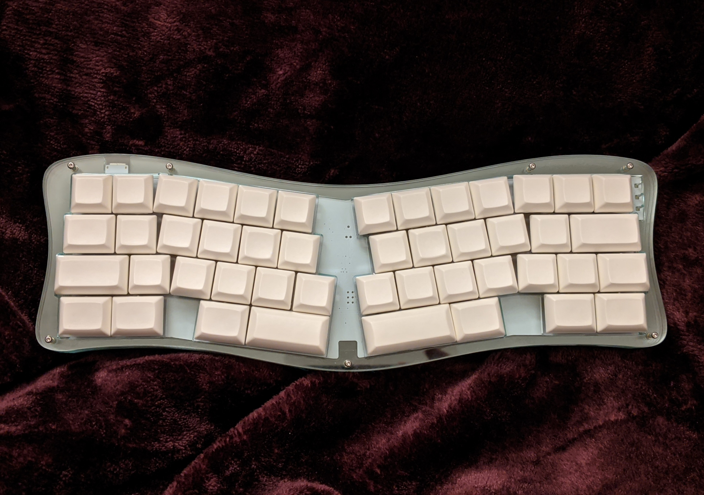
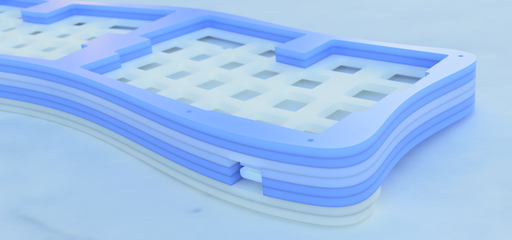

# nabi-case
A butterfly-inspired acrylic case design for the Prime_E keyboard

## Rev 1:

You can use the files in [rev1/prod-files](rev1/prod-files) to cut your own Nabi case or get it cut through the laser cutting service of your choice.

The design calls for 4 mandatory 3mm acrylic layers and 4 optional 3mm layers.
The order of the layers from top to bottom is as follows:

| Layer  | Description | Mandatory/Optional |
| ------------- | ------------- | ------------- |
| Bezel | The upper bezel layer, for a high-profile bezel (hiding the switches, only the keycaps will be visible) | Optional |
| Bezel | The lower bezel layer, for a high-profile bezel (hiding the switches, only the keycaps will be visible) | Optional |
| Plate | The switch plate. This is the top layer if you do a low-profile case. | Mandatory |
| Mid | The upper mid layer, a thin outer layer leaving space inside for the switches and PCB  | Mandatory |
| Mid | The lower mid layer, a thin outer layer leaving space inside for the switches and PCB  | Mandatory |
| Bottom | The bottom plate. This is the bottom layer if you want the case to sit flat on the desk. | Mandatory |
| Large foot | A foot layer if you want the case to sit at an agle. Use with the small foot layer. | Optional |
| Small foot | A foot layer if you want the case to sit at an agle. Use with the large foot layer. | Optional |

You can see the layers fairly clearly in a render here:

In addition the case calls for the following mounting hardware:

| Item  | Quantity |
| ------------- | ------------- | ------------- |
| M2 Screws 10mm | 7 for the high profile case, 4 more if you add the feet layers. |
| M2 Screws 5mm | 14 minus however many 10mm screws you used (above) |
| M2 Threaded cylidrical brass standoffs 5mm, 3.15mm outer radius | 7 |

A word of warning, this case was designed with extremely minimalistic edges in mind, and some of the unassembled acrylic layers (especially the Mid layer) can be quite fragile.
Please exercise caution and a gentle touch when unpacking/unwrapping your acrylic layers or you might end up breaking it.
Once it's assembled it should be perfectly sturdy enough.